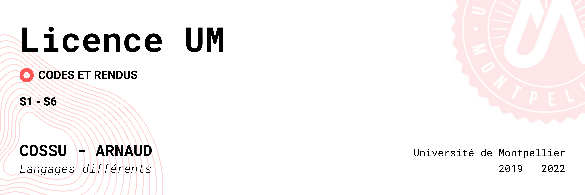

# Licence_Informatique_UM
Documents utiles et réalisés lors de mes années de licence à l'université de Montpellier.

# Warnings
Droits d'auteur © [Cossu Arnaud] [2019-2022]

Tous les droits sur le code source et la documentation contenus dans ce référentiel sont réservés par [Cossu Arnaud]. Toute utilisation, reproduction ou distribution non autorisée de ce code, en tout ou en partie, sans une autorisation écrite préalable de [Cossu Arnaud], est déconseillée. Si vous souhaitez utiliser ce code pour des projets, veuillez me contacter à [arnaud.cossu@etu.umontpellier.fr] pour obtenir l'autorisation nécessaire. En utilisant ce code, vous acceptez les termes de ce copyright.
